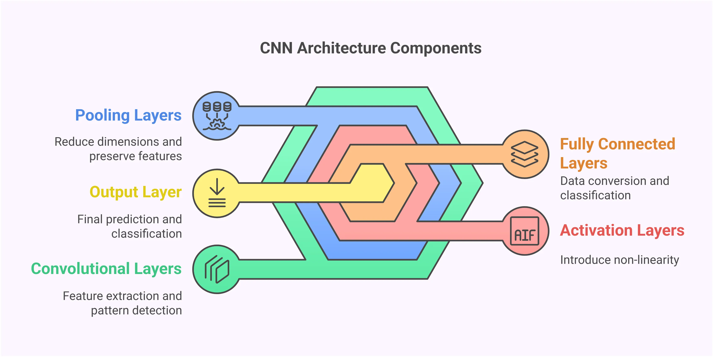

# Deep Learning and Convolutional Neural Networks
A study of architecture design, feature engineering, and training deep learning models.

## Features
- Implementation of ANN training with optimized learning rates.
- Exploration of 2D convolution for feature map extraction.
- Custom CNN architecture design using PyTorch.
- Training and evaluation on the MNIST handwritten digit dataset.

## Technical Implementation: CNN Architecture
Defining a deep learning model with convolutional and pooling layers to extract spatial features from image data.

```python
import torch.nn as nn
import torch.nn.functional as F

class SimpleCNN(nn.Module):
    def __init__(self):
        super().__init__()
        # Conv layer: 1 input channel, 10 output channels, 3x3 kernel
        self.conv1 = nn.Conv2d(1, 10, kernel_size=3)
        self.pool = nn.MaxPool2d(2, 2)
        # Fully connected layer
        self.fc1 = nn.Linear(10 * 13 * 13, 10)

    def forward(self, x):
        # Activation and pooling
        x = self.pool(F.relu(self.conv1(x)))
        return self.fc1(x.view(x.size(0), -1))

```

How it was done
Optimization: Investigated the impact of varying learning rates on training stability, identifying the balance between slow convergence and overshooting.

Feature Extraction: Explored 2D convolution fundamentals, manually implementing kernels to visualize how different filter weights emphasize specific image features like edges.

Deep Classification: Implemented a full CNN pipeline for MNIST, including data normalization, layer design, and backpropagation for digit recognition.

